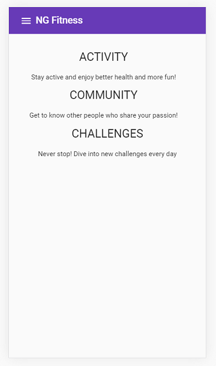
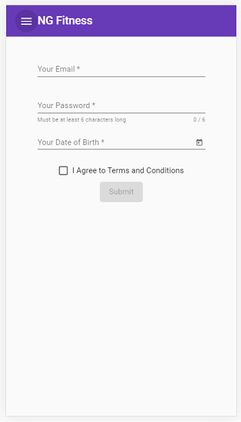
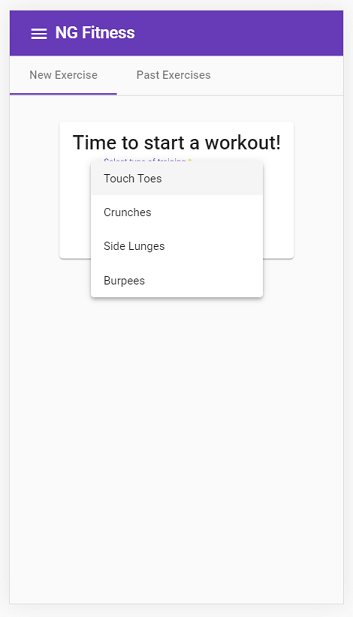
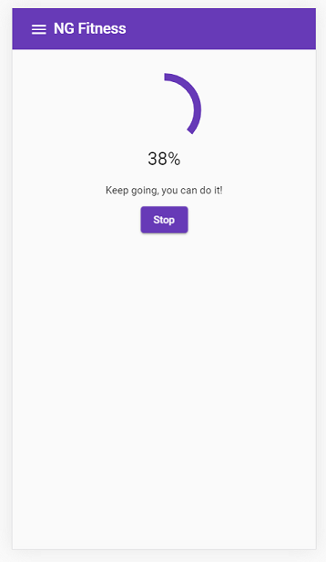

# Fitness Tracker
> An mobile responsive [Angular](https://angular.io/) app which uses [Angular Material](https://material.angular.io/) and works as a timer for your exercises and lets you see past exercises. Live App: 


## Table of contents

* [General info](#general-info)
* [Screenshots](#screenshots)
* [Technologies](#technologies)
* [Setup](#setup)
* [Features](#features)
* [Status](#status)
* [Inspiration](#inspiration)
* [Contact](#contact)


## General info

This project was coded to practice [Angular](https://angular.io/) and [Angular Material](https://material.angular.io/), to achieve a nice looking and modern app. 


## Screenshots

Image#1: Home




Image#2:  Sign up




Image#3: New exercise




Image#4: Current exercise




Image#5: Past exercises


Image#5: Side Menu


## Technologies

* [Angular](https://angular.io/) - version 9.1.0
* [Angular Material](https://material.angular.io/)  - version 9.2.4
* [Cloud Firestore](https://firebase.google.com/docs/firestore)


## Setup

Clone or download the repo.

Install all the dependencies listed on the`package.json` file by running:

```
npm install
```

#### **Run the Angular app in the development mode.**

In the project directory, you can run:  

```bash
ng serve
```

Open [http://localhost:4200](http://localhost:4200) to view it in the browser.

The page will reload if you make edits.

You will also see any lint errors in the console.

#### Code scaffolding

Run 

```bash
ng generate component component-name
```

to generate a new component. You can also use

```bash
ng generate directive|pipe|service|class|guard|interface|enum|module
```

#### Build

Run 

```bash
ng build 
```

to build the project. The build artifacts will be stored in the `dist/fitness-tracker` directory. Use the `--prod` flag for a production build.

#### Running unit tests

Run 

````
ng test
````

to execute the unit tests via [Karma](https://karma-runner.github.io).

#### Running end-to-end tests

Run 

```
ng e2e
```

to execute the end-to-end tests via [Protractor](http://www.protractortest.org/).

#### Further help

To get more help on the Angular CLI use `ng help` or go check out the [Angular CLI README](https://github.com/angular/angular-cli/blob/master/README.md).


## Features

List of implemented features:
* Authentication
* Form validation
* Perform PUT and GET  requests to [Cloud Firestore](https://firebase.google.com/docs/firestore)
* Filter past exercises by type or state
* Select items per page for the past exercises table
* Pagination

List of future improvements:

* Give the home page a better look, with icons and images
* Store each user's past exercises in separate collection, because now it's a massive shared data base between for all users.
* Add a settings tab for creating new exercise types and modifying existing ones. (perform PUT and UPDATE requests).

## Status

Project is _under development_. 


## Inspiration

This project was based on this [course](https://www.udemy.com/course/angular-full-app-with-angular-material-angularfire-ngrx/).


## Contact

Created by [Esteban Munch Jones](https://www.linkedin.com/in/estebanmunchjones/)- feel free to contact me.
